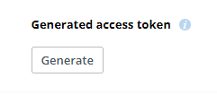
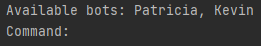
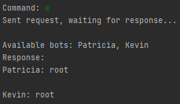
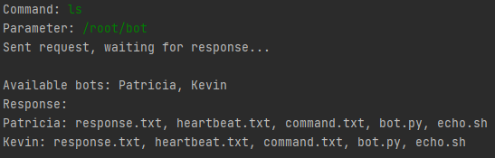
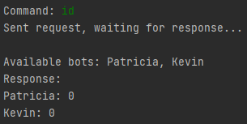
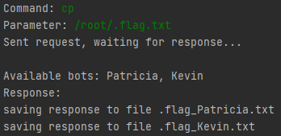
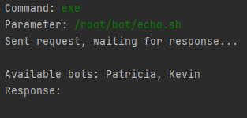
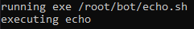

# BSY Stage 7 - Command & Control

Repository for solution to Bonus stage 7, Command & Control.

Controller communicates with bots via Dropbox API.

When running this project, make sure to run controller before bots to ensure correct file initialization.

Controller and bots run on 30-second interval.

## Requirements

For controller make sure to have installed packages:
```
pip install dropbox
pip install pathlib
```

For bot make sure to have installed packages:
```
pip install dropbox
pip install names # used for human names for bots
```

In both scripts you have to provide an access token for Dropbox in the `TOKEN` variable.

You can generate it in your app's settings in Dropbox.



## File structure

heartbeat.txt - used for regular heartbeats from all bots

command.txt - used by controller to send commands to bots

response.txt - used by bots to send response to controller

All bots write into a shared file, each response is prefixed by bot name. Dropbox file revisions are used to mitigate write conflicts. If any bot detects a conflict while uploading a file, it will download it, modify it again and try to upload it. This cycle is repeated until there is no conflict.

## Communication

All communication takes place inside mentioned files in an encoded form. Every string to be written into a file gets first encoded into binary and from that using this dictionary
```
ZWC = {"00": u'\u200C', "01": u'\u202C', "11": u'\u202D', "10": u'\u200E'}
``` 
gets encoded into whitespace characters. The result is that all files appear to be completely empty if you do not display whitespace characters.

This method of encoding is taken from https://github.com/koustubh1317/Steganography-Tools.

## Heartbeat



Each bot has a unique human name which it reports in a heartbeat.

Heartbeat gets checked by the controller every 30 seconds and printed to console.

## Commands

Each command gets executed on all bots at the same time.

All example outputs below are from controller console, bots only print the command that they are running.

### w - list of users currently logged in

**Command: w**



### ls \<PATH> - list content of specified directory

**Command: ls**

**Parameter: \<PATH>**



### id - id of current user

**Command: id**



### cp \<PATH> - copy a file from the bot to the controller

**Command: cp**

**Parameter: \<PATH>**



File content gets encoded same as any other communication and sent via the response.txt. Controller then parses response file and reconstructs the file, each with a name appendinx of '_' and bot name from which the file came.

### exe \<PATH> - execute a binary inside the bot

**Command: exe**

**Parameter: \<PATH>**



Execution does not have any response on controller. Empty response means correct execution.

Example below is from one of the bots. File echo.sh is provided in /bot directory.

